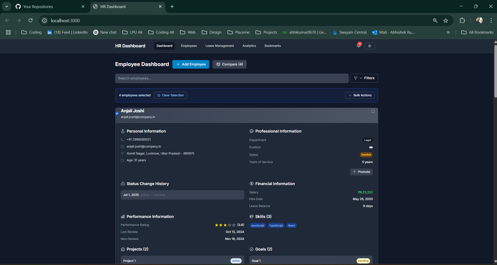
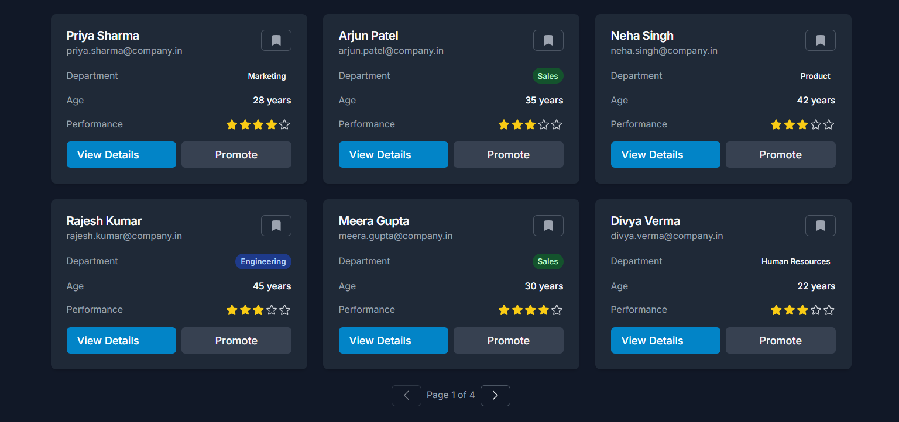
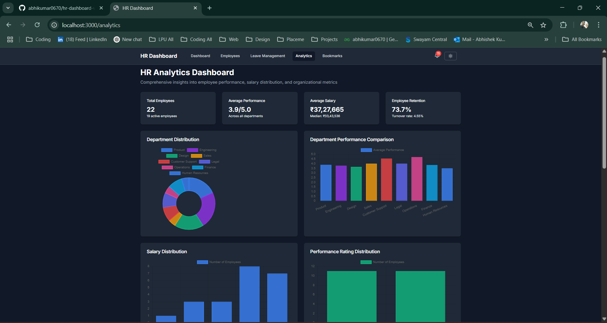
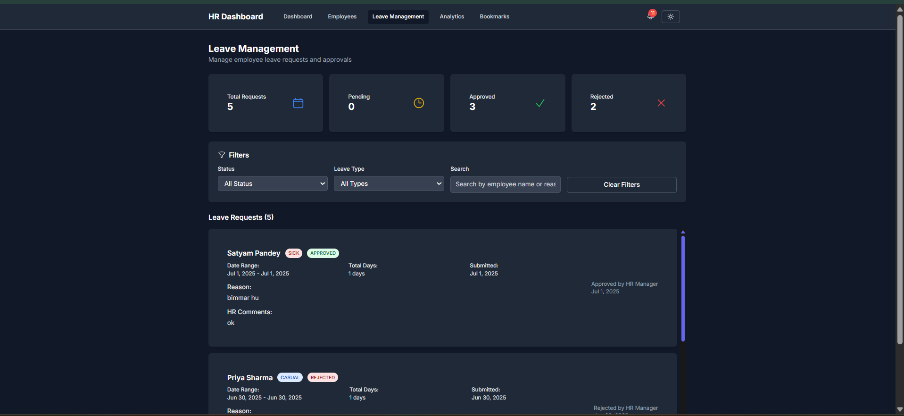
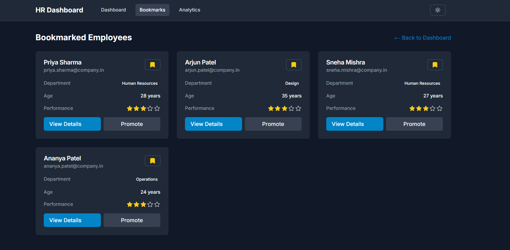

# HR Performance Dashboard

A next-generation HR Performance Dashboard built with Next.js, Tailwind CSS, and Zustand. This platform empowers HR professionals to manage employee data, track performance, and make data-driven decisions with advanced analytics and modern UI/UX.


## 🚀 Key Features

### Employee Management
- **Comprehensive Employee Profiles:**
  - Salary, hire date, manager, position, department, skills, performance history, leave balance, projects, goals, and status
- **Bulk Actions:**
  - Select and manage multiple employees at once (e.g., promote, bookmark, delete)
- **Advanced Filtering & Search:**
  - Filter by department, position, skills, performance, status, and more
- **Employee Comparison:**
  - Side-by-side comparison of employees across all key metrics, including skills, performance, projects, and goals
- **Bookmarking:**
  - Quickly bookmark and access favorite employees
- **Promotion Workflow:**
  - Promote employees based on skills, performance, and other criteria, with single-click actions and promotion history tracking
- **Employee Status Management:**
  - Track active, on-leave, and inactive employees
- **Project & Goal Tracking:**
  - Assign and monitor employee projects and goals

### Leave Management
- **Request Leave:** Employees can submit leave requests through a dedicated modal
- **Leave Balance Tracking:** View detailed leave balances (sick, casual, annual, maternity, paternity, work from home, etc.) for each employee
- **Approval Workflow:** HR can review and approve/reject leave requests
- **Modern Modal Experience:** Consistent, custom scrollbars and always-accessible actions in the leave request modal

### Performance Reviews
- **Add Performance Reviews:**
  - Conduct and record detailed performance reviews for employees
- **Performance Metrics:**
  - Track ratings, comments, goals, and areas for improvement
- **Review History:**
  - View historical performance reviews for each employee
- **Animated & Responsive Modals:**
  - Smooth, accessible review experience with sticky headers/footers and custom scrollbars

### Analytics & Visualization
- **Dashboard Analytics:**
  - Key HR metrics, department and age distribution, performance trends
- **Interactive Charts:**
  - Visualize performance, department stats, and more with Chart.js
- **Detailed Statistics Table:**
  - Drill down into employee and department data
- **Department & Age Distribution:**
  - Visualize workforce demographics and department performance

### Modals & User Experience
- **Consistent, Custom Scrollbars:**
  - All modals (Add Review, Leave Request, etc.) feature a modern, always-visible scrollbar for easy navigation
- **Sticky Headers & Footers:**
  - Modal actions and close buttons are always accessible
- **Smooth Animations:**
  - Framer Motion for delightful transitions
- **Fully Responsive Design:**
  - Works seamlessly on desktop and mobile

### Dedicated Pages
- **Employees Directory:**
  - Full, searchable, filterable grid of all employees, accessible from the navbar
- **Employee Details:**
  - Rich profile view with all data, performance history, and visualizations
- **Analytics:**
  - Deep-dive into HR metrics and trends
- **Bookmarks:**
  - Manage and access bookmarked employees

### Technical Highlights
- **Next.js 14** for fast, modern web app architecture
- **Tailwind CSS** for beautiful, responsive design
- **Zustand** for real-time state management
- **Chart.js** with react-chartjs-2 for analytics
- **Framer Motion** for animations
- **Heroicons** for icons
- **TypeScript** for type safety
- **DummyJSON** for demo API data

## 📸 Screenshots

### Dashboard


### Employee Details


### Analytics


### Leave Management

*Leave management modal and features*

### Bookmarks


## 🛠️ Getting Started

1. **Clone the repository**
   ```bash
   git clone https://github.com/abhikumar0670/hr-performance-dashboard.git
   cd hr-performance-dashboard
   ```
2. **Install dependencies**
   ```bash
   npm install
   ```
3. **Run the development server**
   ```bash
   npm run dev
   ```
4. **Open the application**
   Open [http://localhost:3000](http://localhost:3000) in your browser

## 🗂️ Project Structure

```
src/
├── app/                    # Next.js app directory
│   ├── analytics/         # Analytics page
│   ├── bookmarks/         # Bookmarks page
│   ├── employee/          # Employee details page
│   ├── employees/         # Employees directory page
│   └── page.tsx           # Dashboard page
├── components/            # React components
│   ├── modals/           # Modal components (Add Review, Leave Request, etc.)
│   └── ui/               # UI components (filters, cards, etc.)
├── lib/                  # Utility functions
├── store/                # Zustand store
└── types/                # TypeScript types
```

## 🤝 Contributing

Feel free to submit issues and enhancement requests!

## 📄 License

This project is licensed under the MIT License - see the [LICENSE](LICENSE) file for details.

## 👤 Author

Abhishek Kumar  
- GitHub: [@abhikumar0670](https://github.com/abhikumar0670)  
- Email: abhikumar0670@gmail.com 
